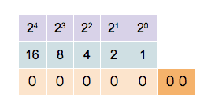
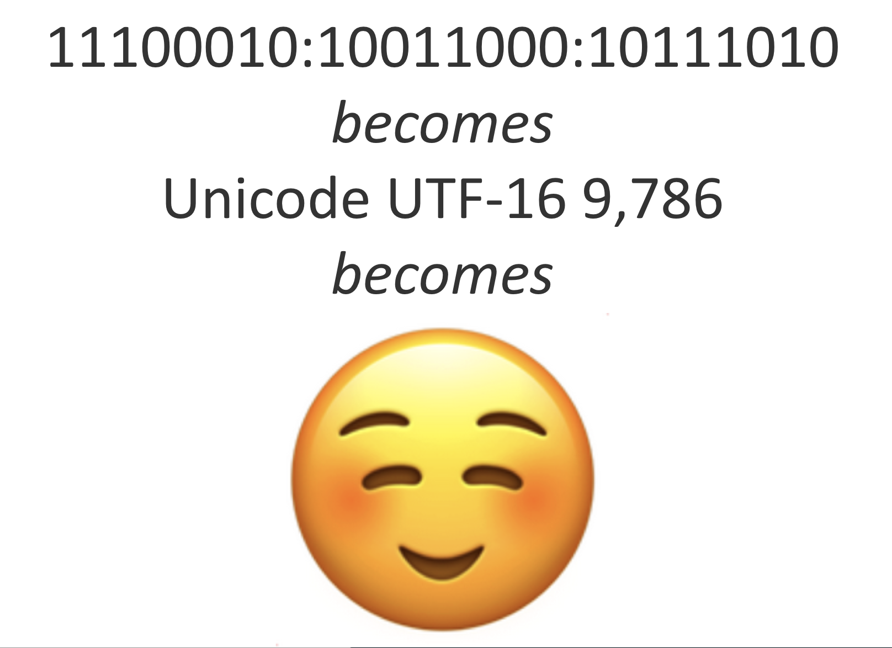
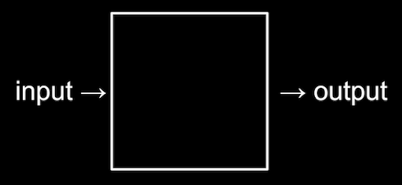
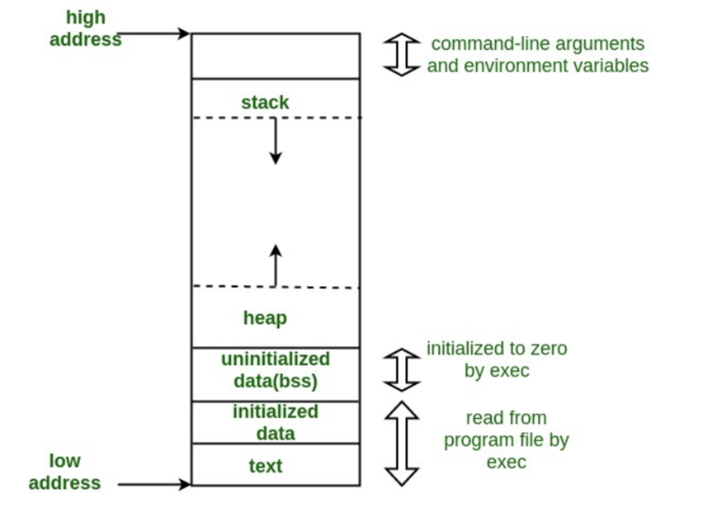
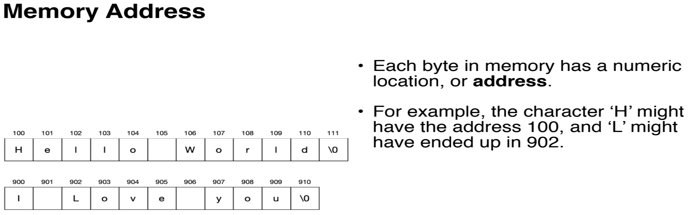

# Hello, World

## What is Computer Programming?

## Computers are dumb; you are smart
- But! They can remember a lot and they're patient

## Binary Numbers

## Context is everything
- Context is called the "environment" in programming
- Information that you can take for granted in the environment is "abstracted-out"

## Abstraction
- Lower-level implementation details are hidden below higher-level ideas, can be taken for granted in the environment
- e.g., music metaphors will work in this programming class because this is a music school

## Representing Data in Computers

## Algorithmic Thinking & Algorithms
- Thinking: breaking the steps of a long operation down into small, explicit substeps and anticipating contingencies
  - Cooking with recipes
- Algorithms: chains of instructions for simple operations that come together to accomplish a complex task

## 20 Questions in Boolean Logic

## Introductions
- Name+Pronoun
- Major+Principal Instrument
- Semester@Berklee
- Recent or Current Project You're Most Excited About
- What operating system are you on?
- How are you doing on storage?

## Big Picture
- Survey of a few languages
- Teaching you to problem-solve patiently, precisely, and creatively

## Syllabus (the README.md for this whole repository)

## Tools of the Trade
- [Pulsar](https://pulsar-edit.dev/)
- [Markdown](https://github.com/adam-p/markdown-here/wiki/Markdown-Cheatsheet)
  - metadata
- Version Control with Git + GitHub.com + GitHubDesktop
  - your harddrive
  - "the cloud"
  - /a rant against iCloud
  - non-destructive editing

## Tools Setup Order of Operations
  - Download and install [Pulsar](https://pulsar-edit.dev/)
  - Go to [GitHub.com](https://github.com/) and make an account (your username should be kind of professional)
  - Download and install [GitHubDesktop](https://desktop.github.com/)
  - Sign into your GitHub account *through* GitHubDesktop

## THE TWO REPOSITORIES OF THIS CLASS
  - One to share my materials with you (261) (clone mine)
  - One to share your materials with me (itp) (make yours)

## CLONE MY/MAKE YOUR REPOSITORY CODE ALONG

## Version Control with Git+GitHub.com+GitHubDesktop

Git is a backup and collaboration tool for individuals and groups working together on software and hardware projects. GitHub is a particular platform on which a user can make use of Git features.

Git records changes you've made to a file rather than the file itself. This is why a focus is put on the lines added and removed from a project during any commit. This system makes two things easier: First, a user can revert to any previous commit. Say your software worked well yesterday, but now it's broken. If you're simply editing a file on your computer, you have no way of looking through your past actions. Second, GitHub doesn't need to store large amounts of data to store simple changes, as it only records the differences between files as opposed to the files themselves.

### Making a New Repository

In Github Desktop, a new repository (repo) can be created by clicking "Current Repository" on the top left, and then "add", and then "create new repository".

A repo can also be downloaded from GitHub.com by clicking "Current Repository on the top left, and then "add", and then "clone repository". This will allow you to input the URL of the GitHub.com repo you'd like to clone and the destination you'd like to clone it to.

Repositories are like folders but! they must have a file in them to be updated with Git. Empty folders made on your computer cannot be synced up to GitHub.com (the cloud).

#### Logging Changes

See the previous commits of a project in GitHub Desktop in the "History" pane of GitHub Desktop.

#### Updating to GitHub.com: Staging, Committing, Pushing

- Stage all (staging is where you customize what changes go into the commit)
- Add commit message (explains what your change is)
- Push to remote

#### Updating from GitHub.com

- Fetch: see what is changed
- Merge: changes your local (hardrive) copy to match the remote/cloud (GitHub.com)
- Pull: Fetch + Merge

#### Other Resources

There are many great online guides to Git, from a very simple one [here](http://rogerdudler.github.io/git-guide/) to a slightly more detailed one [here](https://medium.freecodecamp.org/what-is-git-and-how-to-use-it-c341b049ae61). There is also a great [codecademy course](https://www.codecademy.com/learn/learn-git) on Git.

## Memory

**[How Computer Memory Works Ted-Ed by Kanawat Senanan](https://www.youtube.com/watch?v=p3q5zWCw8J4)**

**RAM**
- Transistor (type of semi-conductor): switches signals
- Capacitor: stores electricity
- Structure
	- Address Line: where data moves in 1 bit pulses of electricity
	- Data Line: where data is is stored (8 bits in every Byte)

**Data Types**
- Integer: whole numbers
- Floating Point: decimal numbers
- Array: collection of elements
- String: array of characters where order matters (text!)
- certain data types take up certain amounts of memory in certain environments
- integer is 4 bytes or 32 bits in Python, float/floating point is 8 bytes or 64 bits

**Memory Layout**
- Stack
	- Where variables and functions hang out waiting to be used (environment)
- Heap
	- Where to find free memory for environment
- Low address
- High address

**Memory Address**
- the address is the "index" in the array or string

