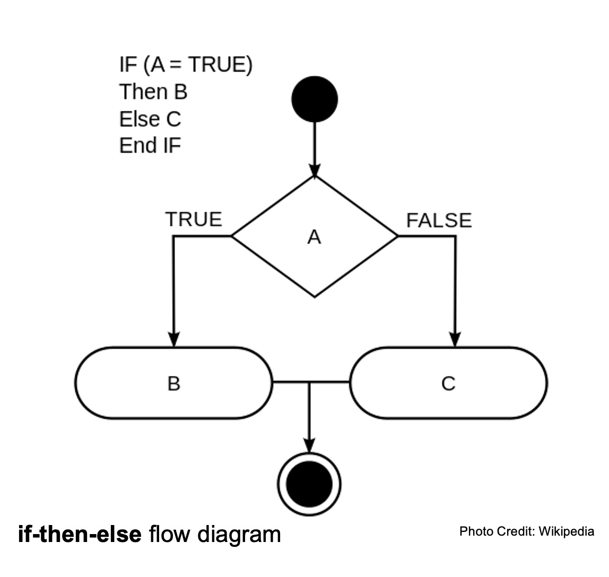

# Scratch

## Basic Principles of Coding
- Sequential Execution: instructions are executed in the order they're written in the program
- Functions: actions/verbs (little mini-programs that are "encapsulated")
- Variables: grasp and store values
- Loops: cycles/reiterations of execution
- Syntax: expectations information organization
- Threads: multi-tasking
- Conditions: Check for "Truthiness" with Boolean Logic

## Before you Code

### Pseudocode
- Break down the way to solve to problem into the smallest tasks possible, but in the language you speak to yourself
- Think like a computer, be literal! Algorithmic thinking!

### Simon Says Pseudocode
- Imagine we are each a machine.
- Give us precise instructions for a simple dance using one function, one condition, and one loop.

## While you Code

### Code Reuse
- Stand on the shoulders of giants
- Be a good collaborator

### Always be Documenting
- Documentation outline in the syllabus

## GitHub+theOL Report/Refresher
- Let's make a folder for next week's assignment

## Reading Group Reports
- A
- B
- C
- D

## Tower of Babel

### Compiled vs Interpreted Computer Languages
- Compiled: human readable > machine readable (C, Fortran)
  - harder to write, easier to run
- Interpreted: human readable > interpreter > machine readable (Python, Javascript)
  - easier to write, harder to run

### Compiled languages: Source, Object, Compiler, Executable
- Source: what we write (human readable)
- Compiler: translates from source to object
- Object: binary (machine readable) (*you'll need one of these for the homework next week, hint hint*)
- Executable: actually runs program

## [Scratch](https://scratch.mit.edu/)
- Sprites: characters
- Costume: image of character
- Threads: how to multi-task
- How to save as an .sb3 file
