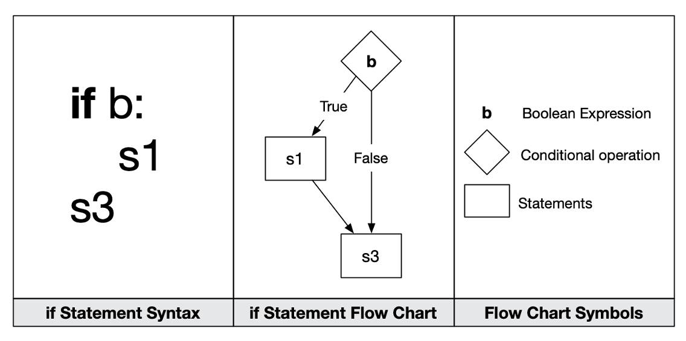
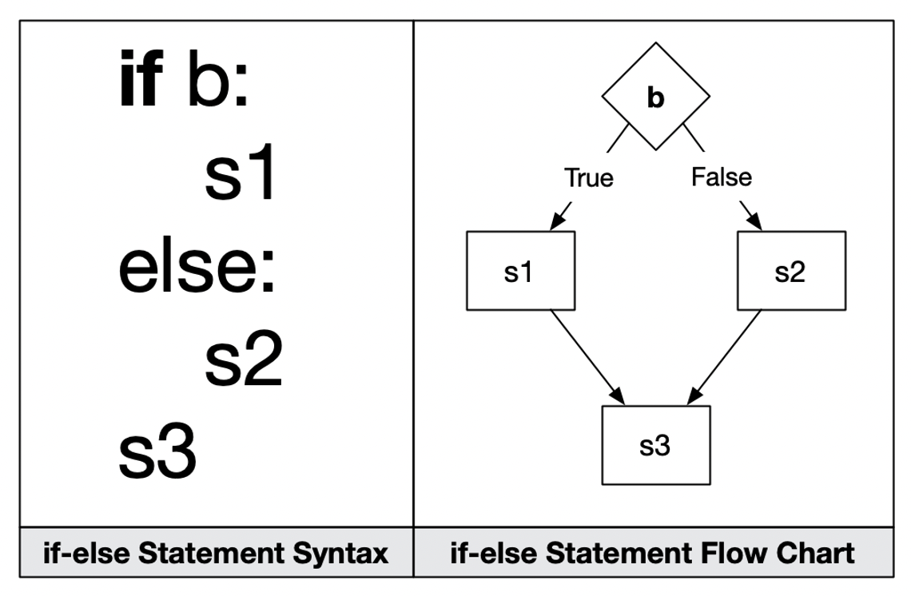
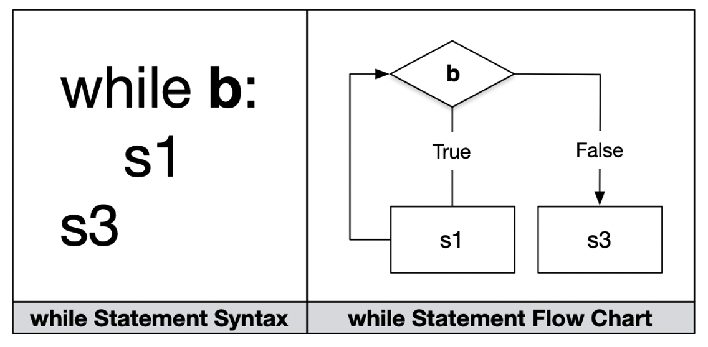
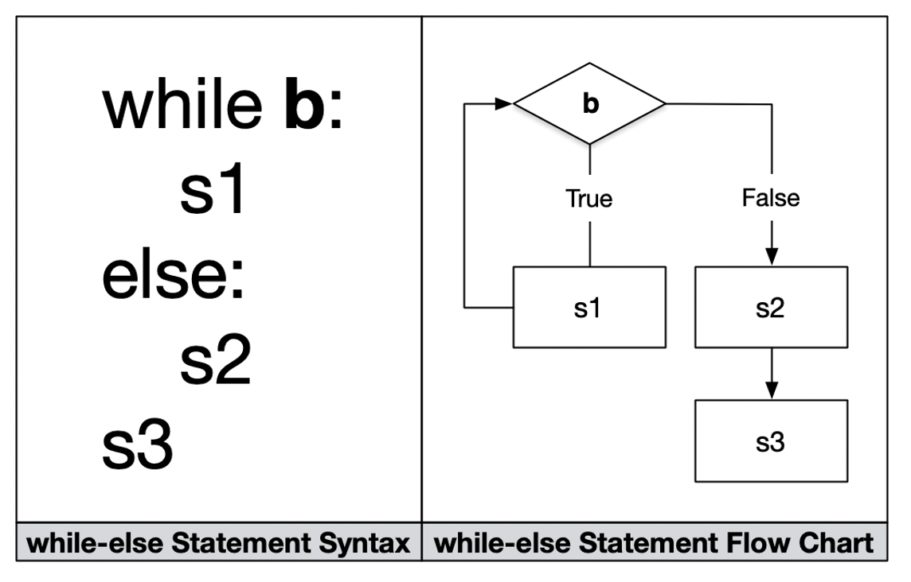

# Control Flow
- Order in which statements are evaluated by the **interpreter**

## Conditional Statements
- Control flow is determined by conditional (decision-making) statements
- Conditional statements use Boolean Logic (testing for truthiness!)
- In Python: if, if-else, if-elif-else are our primary conditional statements
- If, if-else, and if-elif-else are all **iterative** conditional statements, meaning they're not self-referential

### Iterative Conditional Statements
**If**
- Executes one part of the program if **True**
- If **False**, jump to the end of the statement

```python
midiNote = 64
if midiNote < 0 or midiNote > 127:
  print("The note value entered is an invalid MIDI note.")
if midiNote >= 0 and midiNote <= 127:
  print("The note value entered is a valid MIDI note.")
  print("MIDI note value is", midiNote)
```
**If Else**
- Compound statement, provides alternative execution
- Executes one part of the program if **True**
- If **False**, executes another part of the program
- Then jumps to end of the statement

```python
midiNote = 64
if midiNote <= 0 or midiNote >= 127:
  print("The note value entered is Invalid.")
else:
  print("The note value entered is valid.")
```
**If/Elif/Else Conditions**
- Daisy-chained If Else statements
- Boat name? (portmanteau)
```python
midiNote = 64
if midiNote < 64:
  print("MIDI note is smaller than 64.")
elif midiNote > 64:
  print("MIDI note is greater than 64.")
else:
  print("MIDI note is equal to 64.")
```

**Nested If/Else**
```python
midiNote = int(input("What's your favorite midiNote? "))
if midiNote < 64:
    print("MIDI note is smaller than 64.")
    if midiNote == 48:
      print(f"The note name for {midiNote} is C2.")
    elif midiNote == 40:
      print(f"The note name for {midiNote} is E1.")
else:
    print("MIDI note is greater than or equal to 64.")
```

#### 15-min Group Exercise:
<pre>
- Create a file named `BOSseasons.py`.
- Write a program that prints out the seasons in Boston.
- Ask the user to input a number between 1 ~ 12.
- If the number is between 4 ~ 6, print out "Boston is in Spring".
- If the number is between 7 ~ 9, print out "Boston is in Summer".
- If the number is between 10 ~ 11, print out "Boston is in Autumn".
- If the number is between 12 ~ 3, print out "Boston is in Winter".
- If the number range is out of 1 ~ 12, print out "There are only 12 months in a year."
</pre>

### Loops
- Sends control flow back to some point in the program where it was before to repeat process with same environment
- We're often going to use them with accumulators
  - counters
  - range (a built-in function)

### While
  - You don't know how many times you need to loop when you start
  - Repeatedly executes as long as condition is **True**


**While with count**
```python
count = 0
while (count < 3): 	
  count = count + 1
  print("Happy Thursday")
```
or
```python
count = 0
while (count < 3): 	
  count += 1 # just shorthand
  print("Happy Thursday")
```
**While/Else loop**
- Else gives secondary path

```python
count = 0
while (count < 3): 	
  count = count + 1
  print("Happy Thursday")
else:
  print("Happy Friday")
```
#### For
  - You do know how many times you need to loop when you start
  - Iterates over a sequenced object like a list, once per element


**For with range**
- Range is built-in function that generates a list of integers
```python
# Starts at 0 and goes up by one by default
for i in range(128):
  print(f"The next MIDI note value is {i}")
# Increment by 2 instead
for i in range(0, 128, 2):
  print(f"The next MIDI note value is {i}")
```

**For with range and nesting**
```python
for i in range(1500, 2701, 1):
  if i % 7 == 0 and i % 5 == 0:
    print(i)
```
```python
for i in range(10):
  for j in range(10):
    if j >= i:
      print(j, end='') # side to side
  print() # up down
```

## Recursive Control Flow
- Self-referential
- A function that calls itself
- Factorials (8*7*6*5*4*3*2*1=40320) and the [Fibonacci sequence](https://www.mathsisfun.com/numbers/fibonacci-sequence.html) are recursive:
  - Marked by self-similarity
  - Expresses a problem in terms of a smaller version of the same problem
- This *can sometimes* be the most efficient way to ask a computer to solve a problem
- Can also be a tricky way to get a computer to solve a problem
- DON'T CODE ALONG :) we haven't learned functions yet!
```python
# can't stop won't stop - infinite recursion! stack overflow!
def func():
  print("Lovely!")
  func()
func()
```
```python
# recursion with a stop or base case
def func(count):
  if count < 0:
    return
  print(f"{count} Lovely!")
  func(count - 1)
func(5)
```

## [Processing](https://processing.org/download)
- See subfolder!

## For Next Week: FizzBuzz/Pyramid.md
