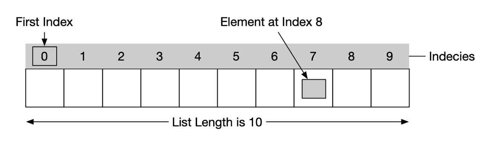

# Lists
## Lists vs Arrays
- Both are collections of related data in a specific order

**Arrays**
- All the data have to be the same type
- Can handle arithmetic
- They need a module

**Lists**
- Related data can be of different type
- Can't handle arithmetic
- Don't need a module

## Intro to Lists in Python
- Use a bracket to enclose
- Lists are ordered, but again, can have different types
- Each item in a list is called an *element*
- Each element is accessed by its numerical index
- The first index starts at 0.



```python
# up to this point, we only knew how to create
# multiple piece of data using multiple variables
x = 1
y = 2
z = 3

# If we use list, we can create a variable
# that can hold three values in one line
a = [1, 2, 3]

# Create a list of strings
strings = ['violin', 'viola', 'cello']

# Create a list of booleans
bools = [True, False, True]

# Create a list with mix type
mixed = ['violin', 200, True, 7.5]

# Print out a list
print(mixed)
```
### Accessing List Elements
- Reference an element by its index number

```Python
instruments = ['Drum', 'Guitar', 'Bass']

print(instruments[0]) # Drum
print(instruments[1]) # Guitar
print(instruments[2]) # Bass
```
### Lists & Loops
- You can use a for loop to iterate through a list
- This is called *list traversal*
```Python
instruments = ['Drum', 'Guitar', 'Bass']

for instrument in instruments:
	print(instrument)
```
- You can also use a counter to iterate through a list with its index value
	- but it has to be data of the same type
```Python
instruments = ['Drum', 'Guitar', 'Bass']
counter = 0

for instrument in instruments:
	counter += 1

print(instruments)
```
### Lists in Processing
- For loops are usually used to iterate through lists in Processing
- You can also a for loop to put data *inside* a list, as is the case in the sinewave.pyde example
	- values from the sin() function are being written to a list in the setup() function, then they become the stroke values in the draw() function
- Something similar is happening in the two record pyde examples
	- at every frame, the mouseY is replaced with a new posiiton
	- each old position is stored in list

## Modules
- Extend the capabilities of your program
- Use the keyword *import* to implement
- Access variables and functions in the module wusing the **.** operator
- Then rename the module, if you like, with the 'as' keyword
```Python
# import a module named random
import random
# Generate random number using random() function
print(random.random())

# Rename the random module to r with the 'as' keyword
import random as r
print(r.random())
```
### From...Import
- Imports only specific features of the module
- Not importing features you don't need keeps your use of the module efficient
- You can use 'as' with this as well
```Python
# import only the random function
from random import random
print(random())

# import only the random function and rename it
from random import random as r
print(r())
```
### Help!
- See what's inside the module with the help function
- Press *q* to exit
```Python
help('random')
help('random.random')
```

## Writing Text Files in Python
- They're writing to somewhere like: /Users/rrome/LoremIpsum.txt
```Python
file = open("LoremIpsum.txt", "w")
file.write(
"Lorem ipsum dolor sit amet "
"consectetur adipiscing elit, sed do "
"eiusmod tempor incididunt ut labore "
"et dolore magna aliqua."
)
file.close()
```
## Reading Text Files in Python
```Python
file = open("LoremIpsum.txt", "r")
print(file.read())
file.close()
```
## Writing CSV Files in Python
```Python
import csv
csv_file = open("People.csv", "w")
# Create a csv writer
csv_writer = csv.writer(csv_file)
# Write the first row (header)
csv_writer.writerow(["Name", "Street", "Number"])
# Add people
csv_writer.writerow(["James", "1st Street", 98])
csv_writer.writerow(["Mary", "10th Street", 271])
csv_file.close()
```
### Reading CSV Files in Python
```Python
import csv
csv_file = open("People.csv", "r")
# Create a csv writer
csv_reader = csv.reader(csv_file)
# Read and print each data row one by one
for row in csv_reader:
  print(row)
csv_file.close()
```
