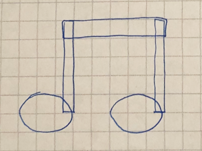
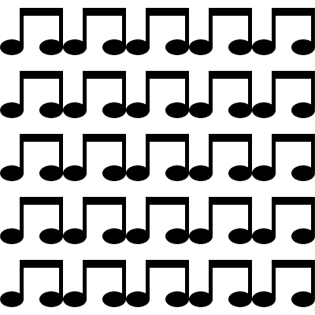
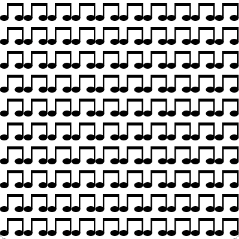
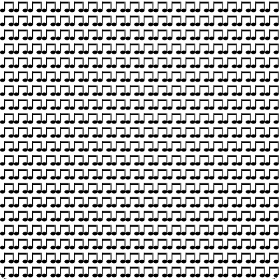

# Midterm Project

The mid-term project is an opportunity to solidify your newly acquired programming skills in Python. You will focus on using `Processing` to draw a visual object designed by you based on overlapping shapes (circles, triangles, squares, etc.). The goal of this project is to turn your design sketch into computer graphics for tiling. You must use `Processing` for this project.

## Project Procedure
### Phase 1: Sketch Your Visual Object
Sketch your visual object using a pen and graph paper. Remember that your visual object must at least have three shapes. Below is an example object consisting of five shapes drawn on a graph paper:



It is recommended that your sketch uses basic primitive shapes, such as circle, ellipse, rectangle, square, triangle, and quadrilateral. Once you are done with your design, take a picture and include it in your mid-term project folder for submission with the name `Phase1` in it.

#### Sketch Requirements
- Your sketch
	- is named `Phase1`;
	- uses a graph paper or illustration app;
	- and has at least three shapes.
- A MarkDown Documentation File

### Phase 2: Translate to Processing.py Sketch
Using `Procssing`, translate your sketch into a computer graphic representation. Processing (and computer screens) works with a coordinate system. It is essential to realize that the computer screen is nothing more than a fancier piece of graph paper. Each pixel in the screen is a coordinate – two numbers, an `x` (horizontal) and a `y` (vertical) - that determines the location of a point in space. And it is our job to specify what shapes and colors should appear at these pixel coordinates. In the coordinate system for pixels in a computer window, the (0,0) point can be found at the top left with the positive direction to the right horizontally for the x-axis and down vertically for the y-axis. An understanding of this coordinate system will help us draw shapes and set the pixels we want.

If you sketched your object on graph paper, you could give each grid in the graph a unit in pixels. For example, one grid could mean 10 or 100 pixels. We can then use this unit to translate our sketch into a computer graphic representation. The example Processing sketch below shows how this process works:

```Python
def setup():
    size(150, 150) # Set the size of canvas
    noStroke() # Disable drawing the stroke

def draw():
    fill(0) # Fill in with black color
    rect(40, 10,  60, 10) # Draw rectangles
    rect(40, 10,  5, 50)
    rect(100, 10,  5, 50)
    ellipse(30, 60, 30, 20) # Draw ellipses
    ellipse(90, 60, 30, 20)
```

We can see in the original sketch that the visual object is composed of three rectangles and two ellipses. The example sketch assumes 10 pixels per grid for translation. In the `setup()` function, we change the canvas size to 150 px x 150 px using the `size()` function. We also tell Processing that we do not want to draw any stroke using the `noStroke()` function. In the `draw()` function, we tell Processing to fill all shapes with black color using the `fill()` function. We then use the `rect()` function to draw three rectangles. The first two inputs of the `rect()` function are x- and y-coordinates where we want to draw the rectangle. The last two inputs specify the size of the rectangle in terms of its width and height in pixels. Finally, we use the `ellipse()` function to draw two ellipses. The inputs to the `ellipse()` function is the same as the `rect()` function. The result of the Processing sketch with the above code looks like this:


In the process of translating your sketch, determine which shape function you need using [this reference](https://processing.org/reference/#shape). Try to stick to using `2D Primitives` as they are easier to use. Make sure to have at least three shapes in your Processing sketch. Include your Processing sketch in the mid-term folder for submission.

If you need more information on basic drawing in `Processing`, refer to [this tutorial](https://py.processing.org/tutorials/drawing/).

#### Sketch Requirements
- Your Processing sketch
	- is named `Phase2`;
	- accurately translates the original sketch from phase 1; and
	- has more than three shapes.
- A MarkDown Documentation File

### Phase 3: Function
Now that you have accurately translated your original visual object, you will make your `Processing` sketch easier to read, modify, and expand by putting your code into a function. It is common to draw the same shape to the screen many times in `Processing`. Functions make this process easier.

It would be best if you start with the `Phase2` `Processing` sketch as a starting point for this phase. Name your `Processing` sketch `Phase3` and make the canvas size to at least 400 x 400 pixels (It can be larger if you need to) using the `size()` function in the `setup()` function. Create a function named `drawObject` that takes three parameters, `x`, `y`, and `s`. In this function, copy and paste your code for drawing your visual object.

The parameters `x` and `y` are used to position objects on the canvas. Use the [`translate()`](https://processing.org/reference/translate_.html) function to position your visual object within the `drawObject()` function using the `x` and `y` parameters. Transformations are cumulative and apply to everything that happens after, and subsequent calls to the function accumulate the effect. This means you do not need to directly change the position of each shape using their function parameters.

The parameter `s` is for scaling objects. Use the [`scale()`](https://processing.org/reference/scale_.html) function to increase or decrease the size of your visual object with in the `drawObject()` function using the `s` parameter.

Once you have implemented the `drawObject()` function, call this function in the `draw()` function for testing. Start with drawing the object at (0,0) position and scale of 1. If this works as expected, try changing the position and scale to other values.

Now try calling the `drawObject()` function another time right after the first one at a different coordinate. You will notice that the second function draws the object, not at the correct position or scale. This is because the second function call caries on the drawing style settings and transformations from the first function call (In this case, transformation changes made with the `translate()` and `scale()` functions).

Suppose we do not want the second function call to be affected by any transformations from the first function call. In that case, we need to use the [`push()`](https://processing.org/reference/push_.html) and [`pop()`](https://processing.org/reference/pop_.html) functions to save and restore the current drawing style settings and transformations. Go back to the definition for the `drawObject()` function and add the `push()` function at the beginning. Add the `pop()` function at the end of the `drawObject()` function. The `push()` and `pop()` functions work in pairs and must always be present together. With these changes, your second function call in the `draw()` function should not affect the first function call.

```Python
def setup():
    size(400, 400) # Set the size of canvas
    noStroke() # Disable drawing the stroke

def drawObject(x,y,s):
    push()
    translate(x,y)
    scale(s)
    fill(0) # Fill in with black color
    rect(40, 10,  60, 10) # Draw rectangles
    rect(40, 10,  5, 50)
    rect(100, 10,  5, 50)
    ellipse(30, 60, 30, 20) # Draw ellipses
    ellipse(90, 60, 30, 20)
    pop()

def draw():
    drawObject(0,0,1)
    drawObject(0,200,1)
```

#### Sketch Requirements
- Your `Processing` sketch
	- is named `Phase3`;
	- implements a function named `drawObject` with three parameters `x`, `y`, and `s`;
	- uses the `translate()` and `scale()` functions to position and scale your visual object;
	- calls the `drawObject()` function twice in the `draw()` function; and
	- uses `push()` and `pop()` to save and restore the current drawing style settings and transformations.
- A MarkDown Documentation File

### Phase 4: Tiling
In this phase, your job is to take the function you created in the previous phase and tile the canvas with your visual object. Name your `Processing` sketch `Phase4` and make the canvas size to at least 400 x 400 pixels (It can be larger if you need to) using the `size()` function in the `setup()` function.

To effectively use the entire canvas, you must divide the canvas into a grid and figure out the size of each cell. For example, if we have a 10-by-10 grid and your canvas 400-by-400 pixels, each cell size will be 40-by-40 px. We can also observe that each visual object will be separated by 40-by-40 pixels to occupy the entire canvas. Use the `s` parameter in the `drawObject()` function to scale your visual object according to the cell size. Maximize the size of your visual object as much as you can within the given cell size. You can use the [`width`](https://processing.org/reference/width.html) and [`height`](https://processing.org/reference/height.html) variables to access the width and height of the canvas.

When we have a 5-by-5 grid with a canvas size 400-by-400 pixels, the tiles using the example visual object from above will look like this:



When we have a 10-by-10 grid with a canvas size 400-by-400 pixels, the tiles using the example visual object from above will look like this:



When we have a 20-by-20 grid with a canvas size 400-by-400 pixels, the tiles using the example visual object from above will look like this:



Hint: Use nested for-loops to tile your visual objects. The first loop goes through the x-axis of your canvas. The second loop goes through the y-axis of your canvas. You can multiply the cell width with the current x position in the nested for-loop to position your object in the x-axis. For the y-axis, this will be the cell height multiplied by the current y position.

#### Sketch Requirements
- Your `Processing` sketch
	- is named `Phase4`;
	- is based on `Phase3`;
	- tiles your visual object according to the given grid division;
	- scales your visual object according to the grid;
	- maximizes the size of your visual object within the given cell size; and
	- does not resize the window when changing the grid division.
- A MarkDown Documentation File

## Submission
- Make a folder inside your itp GitHub repository called 'Midterm'
- Make 4 subfolders inside the 'Midterm' folder, one for each Phase
- The Phase 1 subfolder should have your sketch as a .jpeg or .heic file alongside your documentation file for that phase
- Your Phase 2, 3, and 4 subfolders should have your sketch as .pyde files alongside your documentation files for those phases
- Push your 'Midterm' folder to GitHub as you have done for previous assignments in the class and submit the link to that folder in Canvas.

## Grading Rubric

Description|Grade
---|---:|
The MarkDown Documentation files are complete. | 10%
Project is presented clearly in class. | 10%
Phase 1 fulfills the requirements. | 20%
Phase 2 fulfills the requirements. | 20%
Phase 3 fulfills the requirements. | 20%
Phase 4 fulfills the requirements. | 20%
**Total** | **100%**
